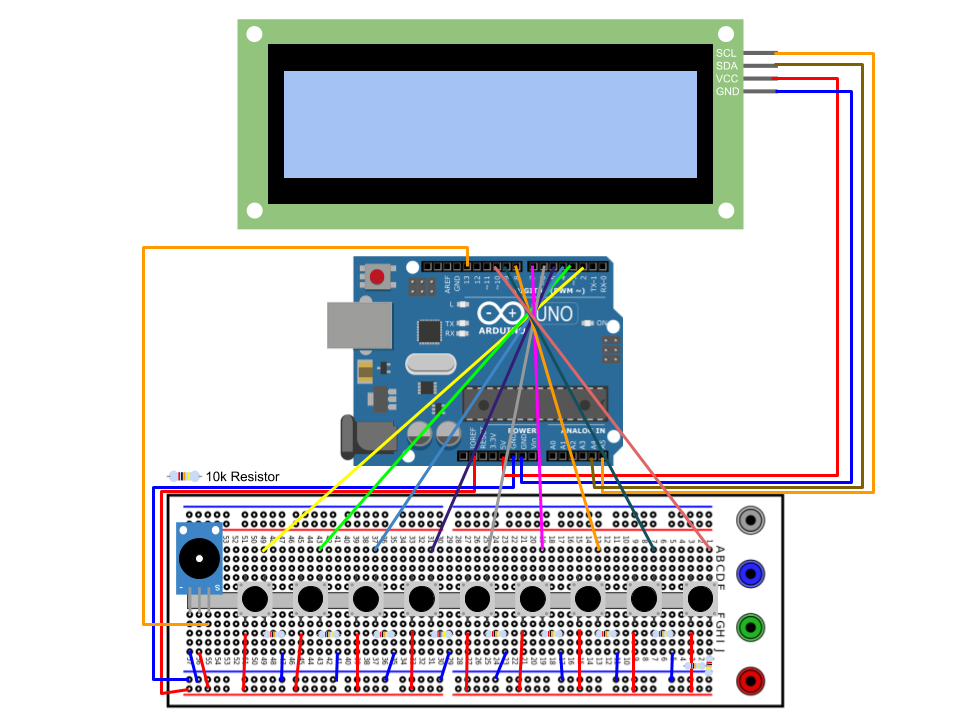

# eTime Bank

## Introduction
   The purpose of this project is to allow a child to manage their own time using electronic devices. It works as a self-service kiosk where the child can track the time spent on household chores, tasks, homework, etc. The kiosk then dispenses and tracks electronic time available to the child. Included in this repo is a copy of the code and a wiring diagram for the hardware.

## Licence
   MIT License

   Copyright (c) 2020 Gabriel Ruiz  

   Permission is hereby granted, free of charge, to any person obtaining a copy
of this software and associated documentation files (the "Software"), to deal
in the Software without restriction, including without limitation the rights
to use, copy, modify, merge, publish, distribute, sublicense, and/or sell
copies of the Software, and to permit persons to whom the Software is
furnished to do so, subject to the following conditions:

   The above copyright notice and this permission notice shall be included in all
copies or substantial portions of the Software.

   THE SOFTWARE IS PROVIDED "AS IS", WITHOUT WARRANTY OF ANY KIND, EXPRESS OR
IMPLIED, INCLUDING BUT NOT LIMITED TO THE WARRANTIES OF MERCHANTABILITY,
FITNESS FOR A PARTICULAR PURPOSE AND NONINFRINGEMENT. IN NO EVENT SHALL THE
AUTHORS OR COPYRIGHT HOLDERS BE LIABLE FOR ANY CLAIM, DAMAGES OR OTHER
LIABILITY, WHETHER IN AN ACTION OF CONTRACT, TORT OR OTHERWISE, ARISING FROM,
OUT OF OR IN CONNECTION WITH THE SOFTWARE OR THE USE OR OTHER DEALINGS IN THE
SOFTWARE.

## Required Parts
+ 20x4 LCD Screen with IC2 backpack/adapter- eg [Amazon Link](https://www.amazon.com/SainSmart-Serial-Module-Shield-Arduino/dp/B0080DYTZQ/ref=pd_sbs_229_t_1/130-4369518-4995030?_encoding=UTF8&pd_rd_i=B0080DYTZQ&pd_rd_r=d407c1f0-24bc-4749-a80b-3501f7aa8c1a&pd_rd_w=vvd5d&pd_rd_wg=MjsBf&pf_rd_p=5cfcfe89-300f-47d2-b1ad-a4e27203a02a&pf_rd_r=NFRMGAC4W1PPRMNQ8N34&psc=1&refRID=NFRMGAC4W1PPRMNQ8N34)
+ Arduino Uno or compatible board- eg [Arduino Link](https://store.arduino.cc/usa/)
+ Momentary Push Button x9- eg [Wish Link](https://www.wish.com/search/Button%20arduino/product/5826c24b07bf4e6f6acc7977?&source=search&position=0)
+ 10k ohm Resistor x9- eg [Jaycar Link](https://www.jaycar.us/10k-ohm-1-watt-carbon-film-resistors-pack-of-2/p/RR2798)
+ Piezo Speaker- eg [eBay Link](https://www.ebay.com/itm/5V-Passive-Buzzer-Piezo-Speaker-Play-Song-Melody-Module-for-Arduino-STM32-TW/152194437534?hash=item236f7ed19e:g:IwQAAOSwhOdXpF7C)
+ Miscellaneous Jump Wires- eg [Ali Express Link](https://www.aliexpress.com/item/32990573297.html?spm=a2g0o.productlist.0.0.c9c82ee6TWFxcc&s=p&algo_pvid=a0395aa1-5202-476c-a795-3a47a2362085&algo_expid=a0395aa1-5202-476c-a795-3a47a2362085-0&btsid=45b6f70b-71ae-46dd-ae2e-2a6c73421663&ws_ab_test=searchweb0_0,searchweb201602_9,searchweb201603_53)

   **Please note that the links provided above are there for reference as to what the part looks like. I have used several suppliers to give the readers an idea of the options available when purchasing parts.  However, one can buy all the components from a single supplier.**

## Wiring Diagram

